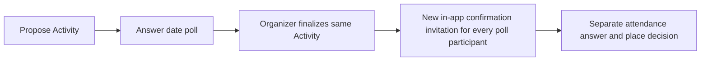

# Activity participation model — proposal for review

**Status:** Reviewed design basis (PR #79) for [#74](https://github.com/Fjacquette/belong-django/issues/74),
2026-10-08. Implementation of slices A/B is bounded below; the remaining capabilities
and independent state changes remain future slices.
Assessed Django baseline: master `6128ccb` (includes #60/#70 and notification PR #73).
[#75](https://github.com/Fjacquette/belong-django/issues/75),
[#76](https://github.com/Fjacquette/belong-django/issues/76), and
[#78](https://github.com/Fjacquette/belong-django/issues/78) are dependencies/follow-ups,
not implemented by slices A/B. Future capability/state replacements remain separately
scoped; current legacy behavior is preserved.

## Slice A implementation boundary

`participation_config` is nullable JSON on Activity and ActivitySeries. Only null
selects compatibility; existing raw choices, responses, invitations and notification
history remain untouched. Configured objects store `{version: 1, pattern, actions}`
with strict known-key/version/pattern/action validation. All seven patterns are
registered; version 1 executes only `view_details` and optional `open_external`.
Planned attendance, Join now, poll, enrollment, registration, payment, contact and
standing opt-in actions cannot be enabled. Creators are offered the current flow or
the working No response required option; other presets are registry configuration,
not selectable claims of working capabilities. Missing pattern on legacy clients
retains the existing creation flow/default.

Configured navigation never creates/changes/removes ActivityResponse, even through
forged invited RSVP POSTs. No-response cards/Details and invitation copy reflect
that behavior; historical evidence remains readable. Series copies configuration
independently into new occurrences and may change future defaults without modifying
siblings or rewriting retained choice JSON. Existing Activity configuration cannot
change via form/admin/model saves in slice A; conversion remains separate work.
No-response configuration does not subscribe users to email or implement #75/#76/#78.

## Slice B implementation boundary

New version 2 configurations enable Scheduled/free open attendance and Immediate
join intent. Only these patterns accept version 2: `confirm_attendance` /
`decline_attendance` or `join_now`, respectively, plus Details and optional external
navigation. Version 1 retains its exact navigation-only meaning even when its
registry pattern is scheduled/immediate. Null remains the unchanged legacy path.
Free (`cost_type=free`, amount absent/zero) is required in form/model validation
and runtime action eligibility; paid/unknown costs need the later #76 policies.

This thin free/open slice uses the existing ActivityResponse as its **single intent
and serialized capacity authority**, not a second competing state. Explicit
scheduled confirmation maps to committed (Going), decline to declined, and immediate
Join now to committed (Joining). The action ID is distinct from stored intent and
from navigation; no link/view creates a response. A limited free place is secured
atomically with affirmative intent, without artificial seat rows for unlimited
activities. Labels describe intended participation, never observed presence.
Separate admission, paid allocations/holds, payment, polls and confirmation rounds
remain later slices; no empty speculative models or conversion are introduced.

Ordinary users act on Details. Invitees get the same meaningful actions directly
on compact cards: scheduled confirmation/decline; immediate Join now only, not a
universal attendance RSVP. Email invitation acceptance records only invitation
identity. Audience access and Group membership remain independent. Capacity remains
under the existing occurrence lock, including toggle/decline/removal and cancellation
races. A full attempt retains the saved response; cancellation freezes it.
Existing note/history/choice JSON is untouched unless the person explicitly changes
or removes their response through the existing behavior. Series defaults copy
version/actions independently; existing Activity configuration stays immutable.
Notification consent/eligibility and old snapshots/delivery IDs remain on the same
response authority, without replaying mail or subscribing invited nonresponders.

## Recommendation

Give each Activity a **participation pattern**: a preset for the question it asks,
its meaningful actions and its policy defaults. Keep one Activity model; pattern
is configuration, not a subtype, audience, Group requirement or proof of attendance.
Keep **intent, admission, place allocation and payment independent**. Poll answers,
questions, contact requests and external navigation are separate capabilities.
There is no global Interested or Willing action/state. Absence of a participation
record is legitimate, especially for polls and informational opportunities.

### Story-to-pattern comparison

These are proposed defaults, not promises that currently unimplemented controls work.
All labels below are examples whose effects must remain fixed when wording changes.

| Pattern / corpus | Initial action and saved fact | Place / invitation meaning | Current Django gap |
| --- | --- | --- | --- |
| Fixed/scheduled — Janine J-06–J-10, Ginger | Confirm attendance or decline; affirmative **intent** is Going, not observed presence | Free/open confirmation secures a limited place atomically. Invitation asks the same attendance question | Current committed/declined and capacity lock fit this slice; ordinary choices need a coherent preset |
| Immediate — Peter, Greg | Peter: Join now explicitly records joining intent; Open game is a separate link. Greg: coordinate the immediate plan, or answer a planning prompt if the plan is still unresolved | Only explicit admission/place allocation affects local capacity; launching an external game proves neither participation nor attendance | Current action URLs and one response status cannot establish whether someone actually joined; Greg must not be forced into an event merely because timing is Now |
| Tentative planning — Bobby, Cindy | Answer the actual date/preferences poll; editable answers live independently of attendance | Invitation initially asks for poll input. After finalization a **new confirmation invitation** asks for attendance; no vote reserves a place | `vote` is only a response label today, not stored poll options/answers or finalization. #75 supplies the first real date-poll flow |
| Ongoing/recurring opportunity — Jan (D&D), Jonas, Sam, James | Request a place in an ongoing game/companion context or sign up under its chosen admission policy | Ongoing enrollment is separate from a particular outing's attendance and capacity. Invitation requests enrollment, not “coming” to every occurrence | Series currently copies defaults only; neither Group membership nor an occurrence response is enrollment. #76 must decide scope/capacity rules |
| Registration — classes/leagues/paid series; Geordi's external class is distinct | Register/request admission; show the actual pending approval/payment steps | “Registration started” is not a secured place. Approval/payment/place policy determines confirmation; invitation starts that same flow | Cost fields describe cost, not a payment ledger. No provider, approval or reservation/hold workflow exists; #76 designs these first |
| Open-ended social inquiry — Alice, Jake | Safe contact/connection request or a concrete question, without attendance state | Invitation requests contact/coordination, not an RSVP. No event capacity is inferred | No conversation/contact delivery model is established. Existing `question` response is not a sent message; safety/consent work is required before enabling it |
| No response required — informational or external opportunity | View Details / Open opportunity; navigation creates **no** participation record | An invitation may draw attention to the opportunity but has no acceptance-to-attendance effect | Empty `available_responses` currently means Tell me more, not “none”; an explicit configuration is needed |

The rest of the named corpus tests composition rather than adding more presets:
Mike/Thurston/Roy/Beverly/Montgomery/William/Kira use an appropriate social,
planning, immediate or scheduled pattern; locality, accessibility and low pressure
remain constraints. Lovey/Hikaru/Christine and Willy/Mary Ann/Jean-Luc require
separate aid/trust/minors safeguards; Reginald tests accessibility across patterns.
Marcia/Janice/Leonard need consent and power-boundary review; Benjamin's shared
expense needs #76-style financial policy, not an automatic paid-place promise.
Jadzia's companionship does not imply clinical/crisis support. Deanna/Carol/Quark
remain policy-review/excluded cases in [USER_STORIES.md](USER_STORIES.md), not newly
authorized participation modes.

### Cross-Activity case — Frank’s spontaneous sandcastle outings (#78)

[#78](https://github.com/Fjacquette/belong-django/issues/78) adds a standing,
revocable **Notify me about future sandcastle outings** relationship, separate from
all seven participation presets. It grants permission to invite this person to
future occurrences of a specific opportunity. It is not participation intent/status,
a poll answer, ongoing enrollment, Group membership, a place, or an RSVP to an
unknown date. Prior attendance never creates it automatically; it is not blanket
email-marketing or general messaging consent. This is a design scenario only;
no #78 functionality is implemented in this PR.

**Candidate scope and owner:** a person-owned follow/notify relationship to one
organizer-owned standing opportunity or Series, with explicit purpose, active/revoked
consent and timestamps. The Series may supply reusable defaults without acquiring
mandatory membership/subscription semantics. If a standing open-ended Activity is
the surface, this relationship still lives outside its ActivityResponse. Exact
storage, standing-context lifecycle, organizer-transfer/consent-renewal rules and
whether the surface belongs to a Series or separate opportunity remain open for
#78 design. A notification opt-in and an ongoing D&D enrollment are distinct facts.

Proposed flow and regression scenario:

1. Frank publishes the standing sandcastle opportunity; Alice, Bob and Carol each
   explicitly opt into future invitations. No hypothetical occurrence response,
   enrollment, Group membership or capacity allocation is created.
2. When Frank decides to go tomorrow, he copies reusable defaults into a **fresh
   Activity** and sets actual date/time/place. He selects from the currently opted-in
   audience, with a simple preselection and the ability to omit someone. Reuse the
   Series-copy or approved #68 clone flow; preserve prior outings and never copy
   their RSVPs or invitations as evidence of consent.
3. Each selected person gets this occurrence’s independent invitation, using its
   participation pattern. Audience authorization still gates disclosure and action;
   neither standing opt-in nor invitation expands visibility. Email is a separate,
   proactive invitation notice only when current verified-address, permission,
   channel preference/consent, sender and delivery controls permit it. Do not promise
   inbox delivery; preserve in-app invitation state independently of mail failure.
4. Alice confirms this outing, Bob declines it and Carol does not answer. Only
   Alice’s actual occurrence response can secure a place under its policy. The
   organizer sees occurrence-specific responses; nobody auto-RSVPs from the list.
5. Frank creates a later outing with fresh invitations, capacity and cancellation.
   Bob may still receive its invitation despite declining the first trip, unless
   he separately revokes his standing opt-in. Opting out stops future selections
   and unsent standing-opt-in notices, without deleting existing invitations,
   changing prior/current occurrence responses, cancelling a place, leaving a
   Group or altering unrelated notification preferences.

Future tests must cover explicit opt-in/opt-out, selectable/omitted recipients,
no implicit signup from attendance, independent outings/RSVPs, revoke-vs-send races,
visibility loss, verified/channel-ineligible users, bounded retries/deduplication
and unchanged prior history. Organizer access to the list is limited to inviting
people to actual outings in its agreed scope; no arbitrary marketing/message relay.
Standing-context archival stops future invitations without erasing occurrence history.

## Actions and independent state

A UI action has a defined server effect, not an arbitrary label mapped onto a giant
enum. Proposed conceptual records (exact fields/names await implementation review):

| Concept | Scope / candidate values | What it must not imply |
| --- | --- | --- |
| Participation intent | User–Activity–confirmation-round fact when explicitly set (one active round): wants to participate, declined, withdrawn; no row means unanswered | Admission, payment, place or physical attendance |
| Admission decision | User–opportunity request: not required, requested, approved, denied; actor/time/reason retained | Approval does not always allocate a place; policy must say whether it does |
| Place allocation | User–capacity pool record: held, secured, released, expired; no row means no allocation | A held place is not confirmed; no allocation is needed for unlimited capacity |
| Payment / transaction | Registration-linked provider facts: initiated/pending, authorized, captured, failed, voided/refunded; applicability comes from policy | Starting payment or authorization alone does not establish attendance or a secured place |
| Poll answer | User–poll option answer, independently editable while open | Going, a reservation, Group membership or a preliminary Willing response |
| Question / contact request | Separate capability record with its own recipients, content, delivery/consent and lifecycle | Attendance or evidence that an external conversation happened |
| External action | Validated navigation link; generally no local write | Completed registration, payment, attendance or a notification subscription |
| Ongoing enrollment | Enrollment in an explicitly identified ongoing opportunity, potentially associated with a Series | An RSVP to all occurrences or joining its optional Group |
| Standing notification opt-in (#78) | Person-owned, revocable permission for future outing invitations from one standing opportunity or Series | Participation intent, an occurrence RSVP/place, Group membership, poll participation, enrollment or blanket marketing consent |

Use separate records for capability data and transactional allocations/payments;
there need not be an empty record in every dimension for every person. A thin free
scheduled flow can begin with intent plus serialized allocation and a policy whose
admission/payment requirements are “none.” Do not introduce empty financial tables
or speculative capabilities solely to fill this diagram.

**Confirmed is derived, never a synonym for “button clicked.”** For a particular
occurrence it requires affirmative current intent, satisfied admission/payment
requirements, and a secured allocation if capacity is limited. An unlimited free
open event requires no artificial seat row. “Going” still describes intended
attendance, not verified presence. Held, approval pending and payment pending must
remain visibly qualified. An enrollment may be active without any occurrence being
confirmed. Failed/refunded financial transactions remain history, not participation
enum values. Cancellation closes participation while preserving all known facts;
financial consequences require #76 policy/provider work.

## Organizer configuration and participant UX

Organizer chooses a pattern through a short explanation (“How will people take
part?”), then sees meaningful actions and relevant policies. Offer supported
capabilities only. Adjust action order, optional questions/links and meaningful
wording within an approved semantic action; wording cannot change capacity or
payment effects. Cross-policy validation rejects contradictory settings. Changing
patterns on an Activity with existing interactions requires an explicit reviewed
transition and affected-user notice, never a silent reinterpretation.

A future Activity stores an explicit configuration/version and pattern; Series
copies these defaults into newly created Activities, just as logistics are copied
now. Existing occurrences do not change when their Series is edited. “No response
required” is explicit and must not be represented by an empty list that invokes a
default. New Activities should choose a pattern before publication; do not guess it
from title, schedule, cost, Group or old sample data. No universal response default
is proposed, including Tell me more; today's default remains during compatibility.

- **Cards:** Band 4 remains description-only; Band 5 carries concise current state
  and a meaningful next action. Ordinary cards navigate to Details, with “See
  details” for informational opportunities and “Answer poll” navigation for planning.
  Invited direct controls are offered only when the selected pattern makes them
  meaningful; scheduled events retain attendance RSVP. Registration/enrollment
  pending labels must never say Going. Rich dimensions live on Details, not crammed
  into a 258×440 card. Historical state retains its explicit legacy read path.
- **Details:** separate attendance/registration, poll, questions/contact and external
  navigation by purpose. Answering a poll and asking a question can coexist with a
  Going response. Do not offer a button whose capability is only a saved label.
  State changes use POST/buttons; navigation uses links; retain filtered Discover
  returns, cancellation/visibility enforcement, keyboard access and no-JS behavior.
- **Roster:** summarize Going / Can't make it for scheduled attendance; Joining for
  explicit immediate intent; Poll answered with option counts for planning; Enrollment
  requested / Active enrollment for ongoing opportunities; Registration pending with
  separate Approval / Place / Payment columns where required. Count **secured places** as confirmed,
  not questions, poll answers, invitations or pending payment. Show unexpired holds
  separately; secured places plus active holds consume the limited pool. Sensitive payment and
  question/contact content remains restricted to authorized relevant users.

### Invitations and notification boundary

Visibility, invitation, Group membership and participation remain independent.
An invitation identifies a person and a meaningful requested interaction from the
Activity's pattern/configuration version. It grants neither audience access nor a
place. Existing direct/group-derived invitation identity and revocation semantics
remain: removing one never deletes participation history. A finalized plan needs a
new confirmation round even if the person was already invited to its poll; a plain
existing `(activity, user)` invitation alone cannot represent that new question.

For [#75](https://github.com/Fjacquette/belong-django/issues/75):

This includes people whose answers are all No/Maybe: they participated in the poll.
Finalization preserves identity, options, answers and any unrelated existing
response. Attendance answers belong to an explicit confirmation round/version; a
prior round is retained as history, not silently overwritten. Existing secured
places are not released merely by finalization; their reconfirmation treatment is a
review decision that must be settled before #75 conversion. It does not automatically mark anyone Going or reserve seats. A person
who never answered remains an ordinary viewer. Every poll participant receives the
in-app confirmation relationship even when current visibility prevents disclosure;
withhold private details/actions until access is valid. Its scope must not become a
public “you were invited to this private plan” leak. Cancellation prevents finalization
or confirmation; finalize/RSVP races must serialize with occurrence mutations.

Today #67/#73 snapshots non-declined `ActivityResponse` recipients. Real poll answers
will not be fabricated as responses to satisfy that predicate. #75 must add an
explicit confirmation-invitation event/audience adapter: all poll participants get
the in-app state; email is only for verified, opted-in, currently permitted users,
with sender authority, fixed content, bounded delivery and existing abuse controls.
An invitation is not itself a subscription to all later updates. Future update
recipients must be chosen explicitly from real participation/capability records
(e.g. enrollment, answers, question context), not everyone who clicked a link. Keep
#73's legacy eligibility and current consent unchanged until that adapter is reviewed.
Whether poll-only participants continue receiving routine updates after finalization
is an open decision below; do not inherit it accidentally from the old enum.

For #78, standing opt-ins require a separate occurrence-invitation event/audience
adapter, not synthetic responses to satisfy #73’s non-declined-response predicate.
Recheck standing consent, selected audience and channel eligibility before dispatch;
opt-out must suppress unsent standing-origin notices. Reuse canonical fixed notice
content, verified sender/address checks, bounded quota/retry journals and after-commit
delivery. Whether the current Activity email preference also governs future-outing
invitation email, or needs a separate narrowly scoped channel preference, remains
explicit #78 design work; never silently change the user’s global settings. Per-outing
update/cancellation eligibility follows its own real participation policy. A follow
alone must not subscribe someone to all occurrence updates or create an ActivityResponse.

## Transition from today's Django model

Current evidence: `ActivityResponse.status` in [activities/models.py](../activities/models.py)
stores committed/declined/question/more/vote and historical Interested in one mutable
row per user–Activity. `Activity.active_responses()` filters organizer JSON and uses
Tell me more for an empty configuration. Forms expose five current choices.
[participation.change_response](../activities/participation.py) combines invitation
RSVP extension with creator choices, capacity and cancellation. [views._build_join_context](../activities/views.py)
projects the same status into cards/Details. [invitations.py](../activities/invitations.py)
currently adds Coming/Can't make it for every invitee.
`action*_href` and Details expose external links; `question`/`vote` status writes do
not constitute a sent question or a stored poll answer. [series.py](../activities/series.py)
copies choices into occurrences; [notifications.py](../activities/notifications.py)
and [announcements.py](../activities/announcements.py) use non-declined responses for
delivery/read access. These are the seams to replace incrementally, not evidence
that the future capabilities already exist.

1. **Preserve baseline:** retain #60/#70 routes, card selection/unmatched-state
   display, creator vocabulary, legacy Interested history, free-event locks and #73
   notifications until an approved path explicitly replaces each. Null/new version
   means compatibility, not auto-inferred scheduled event. The proposal phase made
   no migrations, source changes or edits to local data; the reviewed slice A
   boundary above adds nullable configuration without converting existing records.
2. **Add opt-in configuration:** after review, introduce versioned pattern/policy
   configuration and separately scoped semantic actions for explicitly configured
   new Activities. Keep legacy JSON intact. Do not bulk assign patterns to old
   Activities or Series using titles/demo names or guesswork.
3. **Convert explicitly, with evidence:** provide an organizer-reviewed conversion
   for an occurrence. Retain original response rows (status, note, IDs, timestamps)
   and raw JSON as read-only legacy evidence after conversion. Where conversion is
   unambiguous, committed can initialize affirmative intent and the existing free
   seat entitlement, declined can initialize decline. Neither proves actual presence,
   payment, enrollment or a new policy's approval. Never overbook already committed
   people or apply paid terms retrospectively; unresolved mappings block conversion.
4. **Do not fabricate capabilities:** question/more/vote/Interested remain labeled
   prior interaction evidence, with no inferred intent, question text, poll answer,
   payment or reservation. Historical Interested is never selectable or translated
   into Willing/Going. Current historical notes and state remain visible where
   authorized. Past transitions never recorded cannot be reconstructed.
5. **One authority per converted Activity:** use an explicit cutover/configuration
   version and legacy-record references. New intent/capabilities own current state;
   old rows remain history, not a second writable state whose counts/emails compete.
   Preserve a before/after transition record for conversion and future state changes.
   Notification and announcement-access adapters must switch in the same approved
   slice as participation; retain old recipient snapshots and delivery IDs, never
   replay earlier mail. No-response configuration does not erase prior evidence.

Migration regressions must check original row/JSON/note/timestamp preservation,
new/copy defaults, mixed legacy/configured Activities, historical read access,
counts, no double reservation, no message replay and safe cancellation. A conversion
rollback must restore the original read path without deleting post-cutover facts;
prefer disabling the new flow for review over pretending a destructive downgrade is safe.

## Decisions requested before implementation

| Decision | Recommendation for review | Why it matters |
| --- | --- | --- |
| Default creation pattern | Require a deliberate pattern choice, with Scheduled event suggested only in an explicit occurrence flow | Time/date or a Group alone does not establish the user's intended interaction |
| Standing invitation scope/consent (#78) | Person-owned follow/notify relationship to a standing opportunity or Series; purpose-bound organizer selection, revocation and channel eligibility | Exact target/lifecycle, ownership transfer, notification volume and channel-preference semantics need review; this is not enrollment or a new participation preset |
| Scope of ongoing enrollment | Explicit ongoing opportunity with its own capacity/admission policy; Series may link to it later | A weekly D&D place and attendance at next week's game are different commitments; exact ownership/schema awaits #76 |
| Confirmation labels | Going only when confirmation requirements are met; otherwise show Joining, Request sent, Approval pending, Payment pending or Place held as appropriate | No false promise of attendance/place; final short mobile labels need review |
| Poll finalization with a separate existing response | Preserve it as prior evidence; issue a new round and require explicit reconfirmation before counting a **new** finalized plan's places | #75 forbids overwriting history; treatment of already-secured places must be approved before conversion |
| Notifications after planning finalization | Confirmation event for every poll participant; routine updates only for explicitly defined affected people, retaining opt-in/access checks | Whether a poll-only person remains affected is not settled by #73's old response predicate |
| Registration/approval/place/payment policy | Keep free/open allocation now; design approval-secures-place versus first-payment priority, optional holds/waitlists under #76 before enabling them | No payment integration is authorized; refund/void, expiry and provider failures remain explicit product/transaction work |
| Safe inquiry capability | Do not ship contact/message controls until recipient consent and delivery/read permissions are specified | An enum or external click cannot stand in for a working, safe message |

## Proposed implementation slices after review

| Slice | Bounded change | Required evidence |
| --- | --- | --- |
| A — pattern configuration/compatibility | Explicit pattern/version + validated actions; legacy Activities untouched; unsupported capabilities unavailable | All seven configs including genuine no-response; Series copy isolation; creator defaults; no response on GET/external click; migration preservation |
| B — scheduled/free and immediate intent | Separate explicit intent from navigation; pattern-specific invitations; free open capacity stays serialized | Ordinary/invited controls, last free seat, cancellation races, selected-state/card geometry, no-JS and filter retention; no external attendance inference |
| C — approved #75 implementation (not started) | Thin three-date poll → same-Activity finalization → new confirmation round → separate RSVP | Edits/history, every poll participant including No answers, nonresponders, visibility, concurrent finalize/cancel, eligible email/failure state, mobile/no-JS |
| D — #76 design then separately authorized milestones (not started) | Free capped hike vs approval-based ongoing enrollment vs first-payment-priority 12-seat class | Separate roster dimensions; serialized allocation and last-seat race; design hold expiry/idempotency/refund/webhook failures before any real provider integration |
| Separate #78 slice (not started; sequencing requires review) | Standing opt-in → fresh outing from defaults → selected independent invitations → per-outing RSVP | Alice/Bob/Carol scenario; revocation/send races, selection omissions, consent/visibility/delivery, no automatic enrollment/RSVP and unchanged occurrence history |
| E — inquiry/other capability work only when approved | A real question/contact capability with consent and delivery, plus further supported pattern actions | Coexisting actions/intent, recipient privacy, accessibility, no fabricated participation |

Each implementation slice updates DESIGN_SYSTEM, PROJECT_STATE and USER_STORIES,
adds behavior tests, runs Django checks/relevant tests, and presents its exact committed
browser-test HEAD. Slices A/B do not close the remaining implementation phases of #74 or start
#75/#76/#78.
